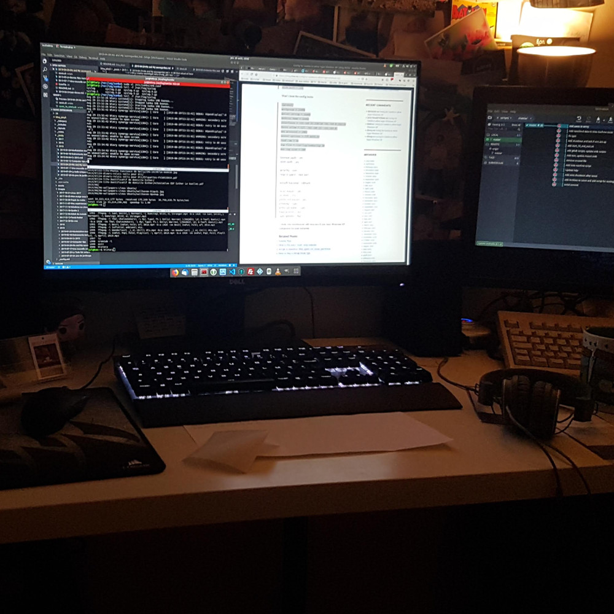

---
# Feel free to add content and custom Front Matter to this file.
# To modify the layout, see https://jekyllrb.com/docs/themes/#overriding-theme-defaults

layout: home
title: Julien Le Gall, Ingénieur logiciel
---
<!-- Introduction -->
<section id="intro" class="main">
    

        

            <header class="major">
                <h2>Introduction</h2>
            </header>
            
Passionné depuis longtemps de tout ce qui touche à l'informatique et au développement 
                d'applications, a acquis de bonnes expériences dans le monde du web, 
                aime se mettre à jour régulièrement sur les dernières technologies 
                de l’information à travers des projets personnels et des conférences.

            
De mes premières pages HTML avec Frontpage 1998 en passant par la génération dynamique côté serveur des pages avec PHP, les 1ères <em>Single Pages</em> avec Dojo jusqu'aux applications web Angular et Symfony, que d'évolution et de dynamisme dans ce milieu qu'est le Web.

        

        
    

</section>

<!-- First Section -->
<section id="experience" class="main">
    <header class="major">
        <h2>Expérience</h2>
    </header>
    <h3><strong>Telecom Monetique</strong> - <em>Février 2019</em> à <em>aujourd'hui</em></h3>
    
Telecom Monetique est une petite entreprise (3 salariées) qui fournit de la téléphonie sur IP et sa connectivité ainsi que des terminaux bancaires. Je suis intégré dans cette entreprise en tant qu'ingénieur logiciel pour optimiser les processus internes notamment en automatisant la facturation et fournir des services en relation avec la téléphonie à nos clients pour ajouter de l aplus value dans nos offres, mes réalisations sont les suivantes :

    <ul>
        <li>Mise en place d'un outil interne de gestion automatisant la facturation : récupération d'informations de nos prestataires via une API, configuration d'un forfait pour chacun de nos clients, génération automatique des factures sur notre outil spécifique à la facturation, envoi des factures par mails à nos clients et sur la plateforme <a href="https://chorus-pro.gouv.fr">Chorus Pro</a> pour les organismes de l'état via <a href="https://communaute.chorus-pro.gouv.fr/documentation/api/">l'API</a>. Les technologies utilisées sont les suivantes : application cliente en <strong>AngularJS</strong> qui intéragit avec une API en <strong>Symfony 3</strong></li>
        <li>Mise à jour de l'espace client, cet espace fournit un accès pour les clients à leurs factures, l'applicatif a été réalisé avec les technologies actuelles : une application cliente <strong>Angular</strong> et une API <strong>Symfony 4</strong> avec authentification via le <a href="https://symfony.com/doc/current/components/security/authentication.html">gestionnaire natif de Symfony</a>, <strong>intégration continue</strong> (tests unitaires Angular et Symfony) avec <a href="https://docs.gitlab.com/ee/ci/">Gitlab-ci</a></li>
        <li>Mise en place d'outils pour la téléphonie : application Windows .NET pour la remontée de fiches client (CTI), intégration d'un CTI dans notre outil de gestion interne, extension Chrome (publiée sur le store) pour faire du <em>click to call</em> vi ale navigateur web en sélectionnant un numéro de téléphone</li>
    </ul>
    <h3><strong>Thales Services</strong> - <em>Juin 2012</em> à <em>Janvier 2019</em></h3>
    
Thales Services est un SSII, entité du Groupe Thales. Au sein de cette société, j'ai pu travailler à des postes et sur des sujets très variés : développement web principalement, intégration, qualification, support. J'ai travaillé en prestation dans une variété d'entreprises qui m'ont permis de discuter, réfléchir avec un grand nombre de personnes sur des projets complexes et ainsi acquérir une flexibilité dans le travail et un sens des priorités. Voici différents projets sur lequels j'ai travaillé :

    <ul>
        <li>Projet <strong>Ma Poste mobile</strong> de <em>mars 2017</em> à <em>janvier 2019</em> : développements web frontend and backend dans les cadres suivants : une application interne permettant aux facteurs de partager des vidéos (style YouTube), s’intègre dans la transformation numérique du groupe <em>La Poste</em> : application Android connectée à un backend, et application web pour l’administration (modération). Mon rôle était de développer de nouvelles fonctionnalités backend (<strong>Symfony 3</strong>) et frontend (<strong>Angular 5</strong>), nous utilisions <strong>Docker</strong> et nous fonctionnions dans un mode Agile (<strong>SCRUM</strong>) avec l'utilisation de l'outil <strong>Jira</strong>.</li>
        <li>Projets <strong>T&A/AWE/Portail</strong>, prestation chez Astellia de <em>janvier 2015</em> à <em>février 2017</em> : développement et support niveau 4 sur 3 projets, <strong>un outil d'aggrégation de données télécom (T&A)</strong> permettant de récupérer des données télécom, de calculer des kpis et de les présenter sous forme de graphes pour mettre en avant des tendances et des alertes, <strong>un portail d'accès</strong> aux nombreuses applications de la société, basé sur Drupal 6 et authentification via le module java Jasig, et <strong>un environnement servant de base aux applications de la société</strong> incluant Apache, Tomcat 6, MySQL, Postgresql, PHP et Java.</li>
        <li>Projet <strong>Erable</strong> pour Orange France de <em>mai 2014</em> à <em>janvier 2015</em> : développement d'un composant d'accès http de routage et d'un serveur de notifications (Apple, Google, HTTP, SMS, SMTP, WNS, MPNS), de manière agile, architecture technique du compsant d'accès (<strong>NodeJS</strong>), utilisation de l'API de notification de Google et Apple pour s'interfaçer avec un composant en Java.</li>
        <li>
            Projet <strong>Orange Football Club</strong>, en prestation chez Orange Labs, de <em>décembre 2013</em> à <em>mai 2014</em> : développement de services REST (<strong>Zend Framework 2</strong>)  pour gérer des compétitions de football, des équipes, des matchs, des résultats et des joueurs, utilisés dans une application Android distribuée dans les pays émergeants de la zone Afrique - Moyen Orient - Asie et <strong>support</strong> aux développeurs Android 
        </li>
        <li>
            Projet <strong>Orthos</strong> pour Thales Communications et Sécurité, d'<em>octobre 2013</em> à <em>décembre 2013</em> : développement d'un <strong>portail web</strong></portail> de gestion de crise (<strong>HTML 5</strong>, <strong>CSS 3</strong>, <strong>JQuery</strong>, <strong>Leaflet</strong>, <strong>Bootstrap</strong>), visualisation de besoins et de ressources sur une carte, création de besoins et <strong>application native Android</strong> pour les propriétaires de ressources permettant l'ajout de ressource, visualisation de statistiques sur un tableau de bord, notifications avec acceptation ou refus
        </li>
        <li>
            Projet <strong>NOC/SOC</strong> pour Thales Communications et Sécurité, de <em>juin 2013</em> à <em>septembre 2013</em> : nouvelles fonctionnalités et corrections d'anomalies sur un démonstrateur web (<strong>HTML 5</strong>, <strong>CSS 3</strong>, <strong>JQuery</strong>) de logiciels de cyber sécurité développés par Thales Sécurité avec 2 versions disponibles, sur 3 écrans pour les showrooms, en standalone pour les commerciaux en mobilité
        </li>
        <li>
            Projet <strong>Newbox / Application Shop</strong>, en prestation chez Orange Labs, de <em>novembre 2012</em> à <em>juin 2013</em> : <strong>support</strong> aux partenaires sur le développement d'applications HTML 5 (<strong>Apis audio</strong>, <strong>vidéo</strong>, <strong>webSQL</strong>, <strong>local storage</strong>, <strong>indexedDb</strong>)et <strong>tests</strong> sur le nouveau décodeur d'Orange avec notamment l'utilisation de <strong>Wireshark</strong> 
        </li>
        <li>
            Projet <strong>TEVOLUTION</strong>, en prestation chez Technicolor, de <em>juillet 2012 à octobre 2012</em> </strong> : projet de télévision OTT (Over The Top) sur lequel j'ai participé à l'intégration du logiciel client sur le décodeur et à la validation de la bonne utilisation des <strong>apis Smartvision</strong> avec l'utilisation d'outils de gestion d'anomalies (<strong>Test tracker</strong> et <strong>Dev tracker</strong>).
        </li>
    </ul>

    <h3><strong>Orange Business Services - IT & Labs</strong> - <em>Avril 2008</em> à <em>Juin 2012</em></h3>
    
Ce fut ma 1ère expérience en SSII avec principalement des missions chez Orange Labs sur des applications web tournant sur des décodeurs tv.

    <ul>
        <li>Conception et développement d'un portail web (<strong>Java</strong>, <strong>JSF</strong>, <strong>Spring</strong>, <strong>Hibernate</strong>) de gestion des offres Orange (API, Hébergement) : gestion des utilisateurs, des projets et souscriptions aux offres, authentification au travers du SI Orange, communication vers les plateformes d'offres d'Orange via web services</li>
        <li>
            Travaux sur l'application shop de la nouvelle offre TV d'Orange (Livebox Play) : création d'une base de connaissance pour créer des applications (via un wiki) et <strong>développement de maquettes d'applications</strong> (Twitter, catalogue unifié pour VOD et jeux) avec le framework maison <strong>IPTV kit</strong> (HTML, Javascript)
        </li>
        <li>
            Développement de services intéractifs (avec <strong>IPTV kit</strong>) sur set-top box : Deezer on TV, portail d'accueil, horoscope, météo, trafic, loto, courses hippiques (avec le partenaire PMU), actualités sur différentes set top boxes : ZE, ZNE. Utilisation de la plateforme d'accès aux données SimpleTV. <strong>Tests de performances</strong> sur les services : accès au service, chargement des données, saturation du réseau
        </li>
        <li>
            Développement d'un portail web sur set-top box fibre : 
            développement et <strong>tests unitaires</strong> sur le service live (lecture et navigation dans un flux vidéo, timeshifting, start-over), création de fiches de test sur l’API de la set-top box Motorola (lecteur vidéo, configuration entrées/sorties Audio/Vidéo, droits d’accès aux flux avec <strong>Viaccess</strong>), développement, utilisation et documentation du <strong>framework OTVF (Orange TV Framework)</strong> sur lequel se base le portail et <strong>correction d’anomalies</strong> sur les différents services.
        </li>
        <li>
            Création et maintenance de composants web 2.0 basés sur le <a href="https://dojotoolkit.org/">framework DOJO</a> : développement, maintenance et <strong>tests unitaires</strong> sur éditeur de texte, grille de données avec chargement dynamique, <strong>support à l’intégration</strong> dans des environnements complexes, rédaction de la documentation sur l’API de ces composants (wiki)
        </li>
    </ul>
    <h3><strong>Benchmark Group</strong> - <em>Avril 2007</em> à <em>Mars 2008</em></h3>
    
Conception et développement de nouvelles fonctionnalités <strong>des sites web à forte audience</strong> (L’internaute, Copains d’avant) : optimisation des requêtes, schémas SQL et cache, utilisation de <strong>PHP</strong>, <strong>PostGreSQL</strong> et <strong>AJAX</strong>

    <h3><strong>L'Ifremer</strong> - <em>Septembre 2005</em> à <em>Mars 2007</em></h3>
    
Conception et développement d’une interface web (<strong>PHP</strong>, <strong>MySQL</strong>) de lancement et de visualisation de modèles hydrodynamiques basée sur le modèle MARS

    <ul>
        <li>paramétrage, lancement des simulations et visualisation des résultats</li>
        <li>mise en place d’outils de gestion de version et de travail collaboratif</li>
    </ul>
</section>
<section id="competences" class="main special">
    <header class="major">
        <h2>Compétences</h2>
    </header>
    
Les sujets sur lequels j'ai pu travaillés sont nombreux, les outils, langages, frameworks sont que j'ai pu utilisés sont aussi nombreux, je met donc en avant les compétences que j'ai envie de connaitre plus en profondeur et que j'ai récemment pratiquées :

    <ul class="features">
        <li>
            
            <h3>Langages</h3>
            
HTML 5, CSS 3, Javascript, PHP, XML

        </li>
        <li>
            
            <h3>Frameworks client et outils</h3>
            
Angular, AngularJS, JQuery

        </li>
        <li>
            
            <h3>Frameworks serveur et outils</h3>
            
Symfony 3/4, NodeJS

        </li>
    </ul>
    <ul class="features">
        <li>
            
            <h3>Bases de données</h3>
            
MySQL, Postgresql

        </li>
        <li>
            
            <h3>Tests</h3>
            
Phpunit, Jasmine

        </li>
        <li>
            
            <h3>Concepts</h3>
            
API Rest, méthodes agiles

        </li>
    </ul>
    <ul class="features">
        <li>
            
            <h3>Editeurs</h3>
            
VSCode, Eclipse, Visual Studio

        </li>
        <li>
            
            <h3>Outils utiles</h3>
            
Git, GitKraken, Gitlab, Gitlab-ci, Docker, VirtualBox, Terminator, Keepass, Wireshark

        </li>
    </ul>
</section>
<section id="formation" class="main">
    <header class="major">
        <h2>Formation</h2>
    </header>
    <h3><strong>Master 2 Génie logiciel</strong> - <em>Rennes, Université de Rennes I</em></h3>
    
Programmation en Java, conception objet, validation et vérification, méthodes formelles

    <h3><strong>Licence, Maitrise informatique</strong> - <em>Rennes, Université de Rennes I</em></h3>
    
Architecture des ordinateurs, systèmes d'exploitation, formalismes et mathématiques pour l'informatique, synthèse 3D

    <h3><strong>DUT informatique de gestion</strong> - <em>Lannion, Université de Rennes I</em></h3>
    
Bases de la programmation, réseaux, architecture des ordinateurs

</section>
<section id="centresinterets" class="main">
    <header class="major">
        <h2>Centres d'intérêts</h2>
    </header>
    <ul>
        <li>Projet Cloud/Auto-hébergement écoresponsable TODO</li>
        <li>Stages et compétitions de danse (<a href="https://www.youtube.com/watch?v=y9fbBrX_rNc">West coast swing</a>) en France et à l’étranger (Royaume-Uni, Etats-Unis)</li>
        <li>Participation à <a href="https://www.paris-web.fr/">Paris-Web</a> 2009, 2013, 2015, 2018, 2019</li>
        <li>Organisation de compétitions VTT, de raids multisports et de trails</li>
    </ul>
</section>
